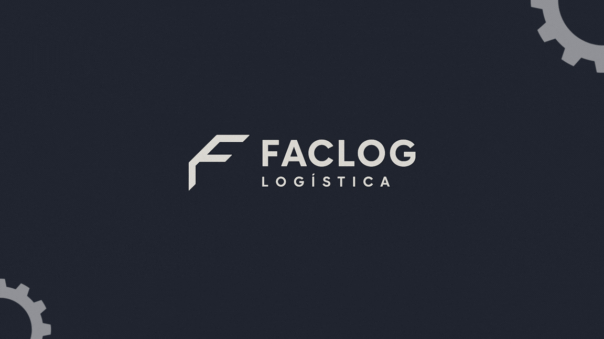

# Projeto segundo semestre - Logistica - Cargas Perigosas

Projeto baseado na metodologia ágil SCRUM, procurando desenvolver a Proatividade, Autonomia, Colaboração e Entrega de Resultados dos estudantes envolvidos

# Índice
* [Objetivo do Projeto](#objetivo-do-projeto)
* [Equipe](#Equipe)
* [Backlog do produto](#Product-Backlog)
* [Competências desenvolvidas](#competências-desenvolvidas)
* [Registro das Sprints](#Registro-das-Sprints)

# Projeto (API) 
Projeto pedagógico alicerçado na Metodologia API para ensino-aprendizado focado no desenvolvimento de competências e fundamentada nos pilares de aprendizado com problemas reais (RPBL), validação externa e mentalidade ágil. 
Uso de estratégias para entender o problema, conceber uma solução viável ao desenvolver e implementar o MVP seguido de sua operação (CDIO).

Desenvolver uma ferramenta de Business Intelligence que apresente o tratamento de dados do IBAMA para cargas especiais para analisar os indicadores de movimentação de cargas. O sistema deve apresentar métricas por estado e nacionalmente, como: quais cargas movimentadas, principais modais de transporte, matriz OD, entre outros.

Os resultados dos projetos devem obedecer ao Aviso Legal disponível no site da Fatec SJC com definição das datas do kickoff e das sprint

# Equipe - Faclog

|    Função     | Nome                                  |        LinkedIn & GitHub           |
| :-----------: | :------------------------------------ | :-------------------------------------------------------------------------------------------------------------------------------------------------------------------------------------------------------------------------------------------------------------------------------------------------------------------------: |
| Product Owner |   Augusto Adriano Silva de Oliveira   |                    |
|  Scrum Master  | Matheus Luiz da Silva Santos   |    
| Team Member  | João Ricardo Rodrigues Araújo  |            |
| Team Member   | Rodrigo Luiz Ramos dos Santos  |                  |
|  Team Member  | Edlaine Aparecida Marcos |                  |    

# Objetivo do Projeto
Este projeto tem como finalidade apoiar a compreensão e a aplicação das normas relacionadas ao transporte de cargas perigosas e especiais, com foco em:

*Classificação de materiais perigosos;
*Legislação e conformidade normativa;
*Gestão de riscos logísticos;
*Boas práticas operacionais;
*Capacitação técnica em logística.

## Tecnologias Utilizadas

* Power Point
* Power BI
* Microsoft Excel (Office)
* Python (Colab)
* GitHub

## Questões para Análise

Para aprofundar a compreensão sobre o comércio exterior dos municípios paulistas, se deve investigar as seguintes questões (se possível):
*	Quais as principais cargas movimentadas?
*	Quais os principais modais utilizados?
*	Quais os principais origens e destinos?
*	Como foi a evolução da movimentação ao longo do tempo?
*	Quais as principais empresas movimentadoras de cargas perigosas com declaração realizada?

## Funcionalidades da Plataforma

A plataforma deverá conter os seguintes módulos:
*	Visualização segmentada por região
*	Dados referentes às movimentações de carga registradas pelo período de 2013 a 2025
*	Mapas e gráficos de tendência

# Product Backlog

| Rank | Prioridade | User Story | Estimativa | Sprint |
|------|------------|---------------------------------------------------------------------------------------------------------------------------------------------------------|------------|--------|
| US1 | Como cliente Marcos, quero um grafico de destino dos produtos, para possibilidade de visualização das informações de destino dos produtos.         | Alta       | 8 pontos   |  1  |
| US2 | Como cliente Marcos, quero um grafico de origem dos produtos, para possibilidade de visualização das informações de origem dos produtos.         | Alta       | 8 pontos   |  1  |
| US3 | Como cliente Marcos, quero um grafico dos produtos e suas quantidades, para possibilidade de visualização das informações dos produtos e suas quantidades.         | Alta       | 8 pontos   |  1  |
| US4 | Como cliente Marcos, quero um grafico dos tipos de transporte, para possibilidade de visualização das quantidades transportadas.         | Alta       | 8 pontos   |  1  |
| US5 | Como cliente Marcos, quero um grafico do anual dos produtos, para possibilidade de visualização da crescente anual dos produtos.         | Alta       | 8 pontos   |  1  |
| US6 | Como cliente Marcos, quero um filtro de destinos dos produtos, para possibilidade de visualização e seleção dos destinos.         | Media       | 4 pontos   |  1  |
| US7 | Como cliente Marcos, quero um filtro de origem dos produtos, para possibilidade de visualização e seleção das origens.         | Media       | 4 pontos   |  1  |
| US8 | Como cliente Marcos, quero um filtro dos tipos de produtos, para possibilidade de visualização e seleção de quais tipos de produtos queremos verificar. | Media       | 4 pontos   |  1  |
| US9 | Como cliente Marcos, quero um filtro dos tipos de transporte, para possibilidade de visualização e seleção dos tipos de transporte utilizados. | Media       | 4 pontos   |  1  |
| US10 | Como cliente Marcos, quero um filtro de anos, para possibilidade de visualização e seleção dos anos de maneira individual. | Media       | 4 pontos   |  1  |
| US11 | Como cliente Marcos, quero visualizar os gráficos com títulos claros, para melhor entendimento das informações apresentadas         | Baixa       | 2 pontos   |  2  |
| US12 | Como cliente Marcos, quero visualizar os gráficos com cores padronizadas, para facilitar a leitura dos dados.         | Baixa       | 2 pontos   |  2  |
| US13 | Como cliente Marcos, quero visualizar legendas nos gráficos, para melhor identificação das informações exibidas.         | Baixa       | 2 pontos   |  2  |
| US14 | Como cliente Marcos, quero aplicar múltiplos filtros simultaneamente, para analisar cenários mais específicos.        | Media       | 2 pontos   |  2  |
| US15 | Como cliente Marcos, quero passar o mouse sobre os gráficos e visualizar detalhes (tooltip), para obter informações mais específicas.       | Media       | 2 pontos   |  2  |
| US16 | Como cliente Marcos, quero um dashboard interativo consolidado com todos os gráficos e filtros funcionando de forma integrada, para permitir uma análise eficiente, comparativa e em tempo real dos dados logísticos.       | Alta       | 10 pontos   |  3  |
| US1  | Como gestor de projeto, quero um gráfico de destino dos produtos, para analisar a distribuição geográfica das entregas e compreender como os fluxos logísticos se organizam em diferentes regiões.     | Alta       | 8      | 1      |
| US2  | Como gestor de projeto, quero um gráfico de origem dos produtos, para interpretar a procedência das cargas e entender a relação entre pontos de origem e destino no contexto logístico.                                                                        | Alta       | 8      | 1      |
| US3  | Como gestor de projeto, quero um gráfico de produtos e suas quantidades, para examinar o volume movimentado por item e identificar padrões de comportamento nos dados analisados.                                                                              | Alta       | 8      | 1      |
| US4  | Como gestor de projeto, quero um gráfico dos tipos de transporte, para comparar os modais utilizados e compreender suas aplicações dentro do cenário estudado.                                                                                                 | Alta       | 8      | 1      |
| US5  | Como gestor de projeto, quero um gráfico anual dos produtos, para observar a evolução dos dados ao longo do tempo e identificar tendências relevantes para a análise logística.                                                                                | Alta       | 8      | 1      |
| US6  | Como gestor de projeto, quero aplicar um filtro por destino, para explorar a distribuição dos dados em regiões específicas e aprofundar a análise geográfica.                                                                                                  | Média      | 4      | 1      |
| US7  | Como gestor de projeto, quero aplicar um filtro por origem, para segmentar os dados conforme os pontos de saída e analisar diferentes cenários logísticos.                                                                                                     | Média      | 4      | 1      |
| US8  | Como gestor de projeto, quero aplicar um filtro por tipo de produto, para examinar o comportamento de categorias específicas dentro do conjunto de dados.                                                                                                      | Média      | 4      | 1      |
| US9  | Como gestor de projeto, quero aplicar um filtro por tipo de transporte, para comparar o uso dos modais em diferentes contextos e interpretações.                                                                                                               | Média      | 4      | 1      |
| US10 | Como gestor de projeto, quero aplicar um filtro por ano, para observar variações temporais e realizar análises comparativas entre períodos distintos.                                                                                                          | Média      | 4      | 1      |
| US11 | Como gestor de projeto, quero gráficos com títulos bem definidos, para facilitar a compreensão imediata das informações apresentadas.                                                                                                                          | Baixa      | 2      | 2      |
| US12 | Como gestor de projeto, quero gráficos com paleta de cores consistente, para melhorar a leitura visual e a interpretação dos dados.                                                                                                                            | Baixa      | 2      | 2      |
| US13 | Como gestor de projeto, quero gráficos com legendas claras, para identificar corretamente os elementos representados nas visualizações.                                                                                                                        | Baixa      | 2      | 2      |
| US14 | Como gestor de projeto, quero utilizar múltiplos filtros ao mesmo tempo, para realizar análises combinadas e obter diferentes perspectivas dos dados.                                                                                                          | Média      | 2      | 2      |
| US15 | Como gestor de projeto, quero visualizar informações detalhadas ao interagir com os gráficos (tooltip), para aprofundar a análise de pontos específicos dos dados.                                                                                             | Média      | 2      | 2      |
| US16 | Como gestor de projeto, quero um dashboard interativo que consolide todos os gráficos e filtros em uma única interface, para integrar as análises, facilitar a exploração dos dados e permitir uma visão completa e comparativa do cenário logístico estudado. | Alta       | 10     | 3      |

# Registro das Sprints

| Sprint            | Previsão   | Status   | Histórico |
|-------------------|------------|----------|-----------|
| Video do Problema | 01/04/2026 | Entregue | [Video](https://www.youtube.com/watch?v=p4WN1IQ7SHc)|
| 01                | 29/04/2026 | Entregue  | [MVP](MVP/sp1.md)  |
| 02                | 20/05/2026 | a fazer  | [MVP](MVP/sp2.md)  |
| 03                | 10/06/2026 | a fazer  | [MVP](MVP/sp3.md)  |
| Feira de Soluções | 18/06/2026 | a fazer  | [MVP](#)  |
